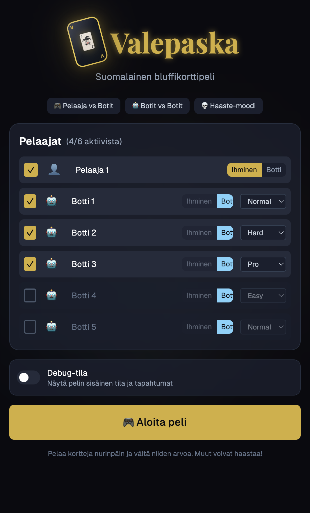

# Valepaska

A TypeScript-based card game engine for "Valepaska" (Finnish Bullshit), a bluffing card game for 3-6 players.



> **🚀 AI-Assisted Development Showcase**
>
> This project demonstrates what's possible with modern AI coding assistants in 2025. The entire codebase — including a production-ready game engine, intelligent AI bots, comprehensive test suite, and polished web UI — was developed from idea to deployment in **under 3 days** using [Cursor](https://cursor.sh) with Claude.
>
> **Project Statistics:**
> | Category | Lines of Code |
> |----------|---------------|
> | Core Engine (`@valepaska/core`) | ~3,400 |
> | Core Tests | ~2,700 |
> | AI Bots (`@valepaska/bots`) | ~790 |
> | Simulator (`@valepaska/simulator`) | ~380 |
> | Web UI (`apps/web`) | ~3,800 |
> | **Total TypeScript/TSX** | **~11,200** |
> | Documentation (Markdown) | ~2,000 |
> | BDD Feature Specs | ~1,500 |
> | CSS Styling | ~270 |
>
> **Test Coverage:** 200 tests across 15 test files, all passing ✅

## Features

- **Game Engine** (`@valepaska/core`): Deterministic game engine with seeded RNG
- **AI Bots** (`@valepaska/bots`): Rule-based bots with 4 difficulty levels (Easy, Normal, Hard, Pro)
- **Simulator** (`@valepaska/simulator`): CLI tool to run thousands of games for analysis
- **Full Event Log**: Complete game history for UI and testing
- **Hidden Information**: Proper separation of game state and player observations

## Technology Stack

| Category | Technology |
|----------|------------|
| Runtime | Node.js 22 LTS |
| Language | TypeScript 5.7 (strict mode) |
| Build | Vite 6 |
| Testing | Vitest |
| Web UI | React 19 + Tailwind CSS 4 + Framer Motion 12 |
| State | Zustand 5 |
| Monorepo | pnpm workspaces + TypeScript Project References |
| Deployment | Vercel |

## Quick Start

### Prerequisites

- Node.js 22+
- pnpm 9+

### Installation

```bash
# Clone the repository
git clone <repository-url>
cd valepaska

# Install dependencies
pnpm install

# Build all packages
pnpm build

# Run tests
pnpm test
```

### Running the Simulator

```bash
# Run 1000 games with default settings
pnpm simulate

# Custom simulation
pnpm simulate --games 10000 --players 4 --bots Easy,Normal,Hard,Pro --seed 12345

# Get JSON output
pnpm simulate --games 1000 --json
```

### CLI Options

| Option | Description | Default |
|--------|-------------|---------|
| `-g, --games <n>` | Number of games to simulate | 1000 |
| `-p, --players <n>` | Number of players (3-6) | 4 |
| `-b, --bots <list>` | Bot difficulties (comma-separated) | Easy,Normal,Hard,Pro |
| `-s, --seed <n>` | Random seed for reproducibility | random |
| `-v, --verbose` | Show progress | false |
| `--json` | Output results as JSON | false |

## Game Rules

### Overview

Valepaska is a bluffing card game where players play cards face-down and claim a rank. Other players can challenge if they think the claim is false.

### Rank Order

```
3 < 4 < 5 < 6 < 7 < 8 < 9 < 10 < J < Q < K < A < 2
```

### Key Rules

1. **Play 1-4 cards** face-down and claim a rank
2. **Claims must progress**: Same or higher rank than previous claim
3. **Special "2" rule**: After claiming 2, only 2, 10, or A are valid
4. **Burns**:
   - Claiming 10 (accepted) → table burns
   - Claiming A (accepted) → table burns
   - 4 consecutive same rank → table burns
5. **Challenges**:
   - True claim → Challenger picks up pile, claimer continues
   - Lie → Liar picks up pile, turn passes
6. **Win**: Empty your hand when draw pile is empty

See `docs/RULES.md` for complete rules.

## Project Structure

```
valepaska/
├── packages/
│   ├── core/           # Game engine (modularized)
│   │   └── src/engine/ # Engine modules (turn-manager, play-executor, etc.)
│   ├── bots/           # AI bots
│   └── simulator/      # CLI simulator
├── docs/
│   ├── IMPLEMENTATION_PLAN.md
│   ├── MODULARIZATION_PLAN.md  # Refactoring plan and status
│   ├── RULES.md
│   └── features/       # BDD Gherkin specs
├── CHANGELOG.md        # Detailed change history
└── README.md
```

### Web UI

The project includes a fully playable web application with:
- **Nordic Noir Casino** design theme (dark mode)
- Real-time bot opponents with 4 difficulty levels
- Card animations with Framer Motion
- Challenge reveal overlays with dramatic effects
- Victory celebrations and standings
- PWA support for offline play
- Responsive design

```bash
# Start development server
pnpm dev

# Build for production
pnpm build
```

### Recent Updates (January 2025)

**Engine Modularization:**
- `game-engine.ts` reduced from 770 to 550 lines (-29%)
- Split into 6 focused modules (turn-manager, hand-manager, play-executor, challenge-executor, burn-executor, bot-runner)
- See `docs/MODULARIZATION_PLAN.md` for details

**Bug Fixes & Improvements:**
- Fixed game freezing when bot wins
- Fixed winner continuing to play after finishing
- Added validation: finished players cannot challenge
- TypeScript Project References for monorepo
- Strict type checking with `exactOptionalPropertyTypes`


## Development

```bash
# Run tests in watch mode
pnpm test

# Run specific package tests
pnpm --filter @valepaska/core test

# Type check
pnpm typecheck

# Lint
pnpm lint
```

## Bot Difficulty Presets

| Level | Bluff Rate | Challenge Threshold | Memory |
|-------|------------|---------------------|--------|
| Easy | 5% | 3.4 (conservative) | None |
| Normal | 20% | 2.7 (moderate) | Basic |
| Hard | 35% | 2.2 (aggressive) | Full |
| Pro | 45% | 1.9 (very aggressive) | Full |

## Vercel Deployment

The project is configured for Vercel deployment:

```bash
# Install Vercel CLI
npm i -g vercel

# Deploy
vercel
```

Or connect your repository to Vercel for automatic deployments.

## API Usage

```typescript
import { GameEngine, createBotPlayer } from '@valepaska/core';
import { RuleBot } from '@valepaska/bots';

// Create players
const players = [
  createBotPlayer('p1', 'Bot 1', 'Easy'),
  createBotPlayer('p2', 'Bot 2', 'Normal'),
  createBotPlayer('p3', 'Bot 3', 'Hard'),
  createBotPlayer('p4', 'Bot 4', 'Pro'),
];

// Create game with seed for reproducibility
const engine = GameEngine.create(players, {}, 12345);

// Register bots
for (const player of players) {
  const bot = new RuleBot(player.id, player.difficulty!);
  engine.registerBot(player.id, bot);
}

// Run game to completion
const winner = engine.runToCompletion();
console.log(`Winner: ${winner}`);

// Access event log
const events = engine.getEventLog();
console.log(`Total events: ${events.length}`);
```

## License

MIT
